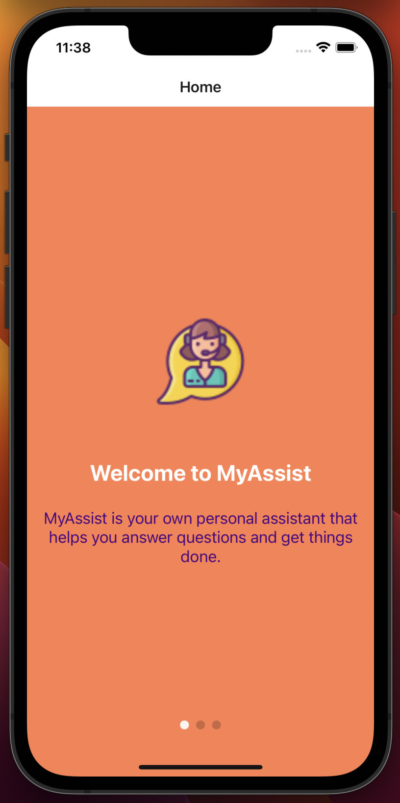
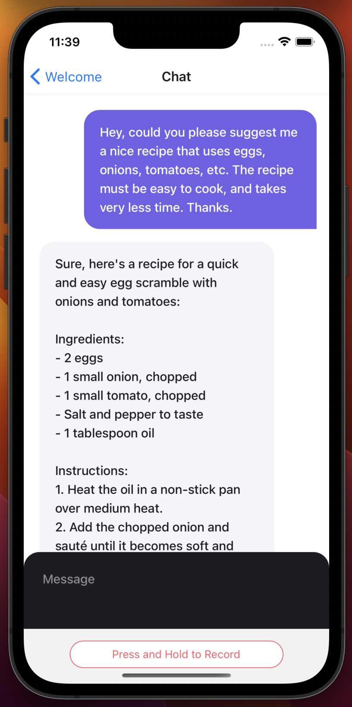
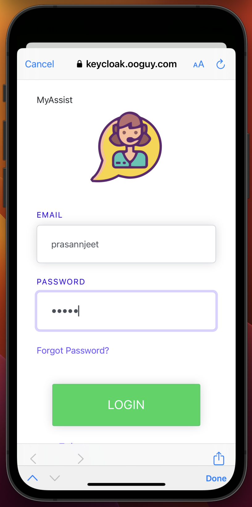
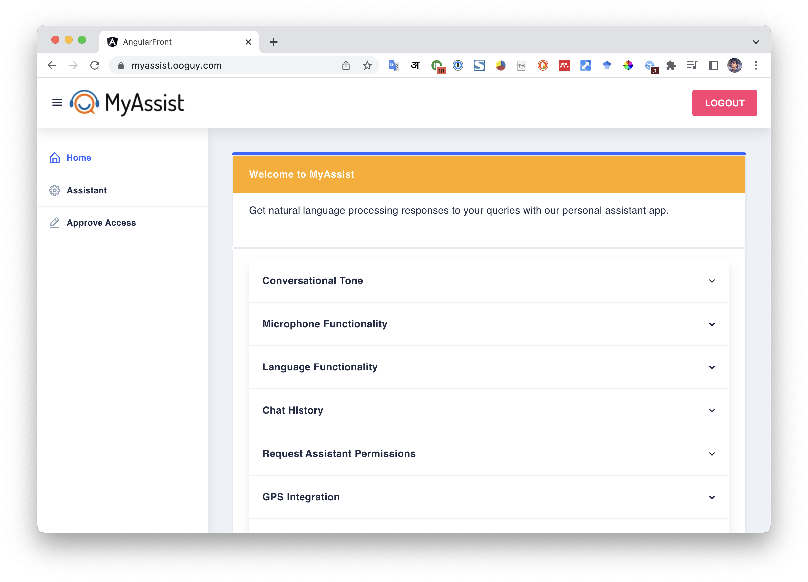
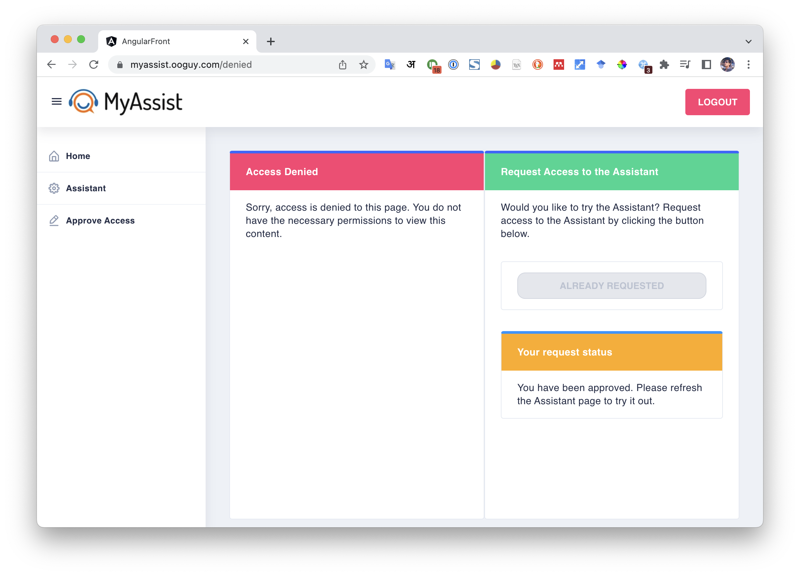
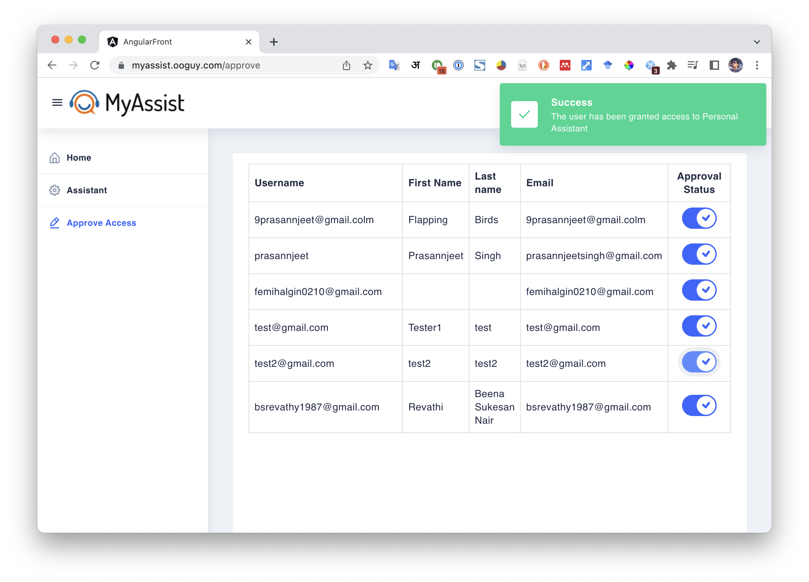
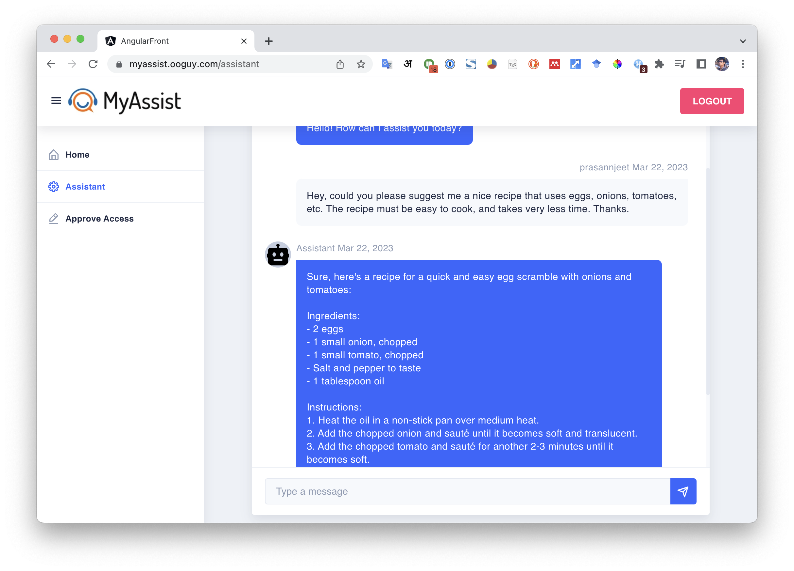

# MyAssist: A Personal Assistant App

## Table of Contents
- [MyAssist: A Personal Assistant App](#myassist-a-personal-assistant-app)
  - [Table of Contents](#table-of-contents)
  - [Overview](#overview)
  - [Features that make MyAssist Unique](#features-that-make-myassist-unique)
  - [Architecture Overview](#architecture-overview)
  - [Application Features, Functionality and Diagrams](#application-features-functionality-and-diagrams)
  - [Implementation Details](#implementation-details)
    - [Angular Web App](#angular-web-app)
    - [Spring BackEnd](#spring-backend)
  - [Screenshots](#screenshots)
  - [Welcome screen, chat screen and login screen in the iOS application for personal assistant](#welcome-screen-chat-screen-and-login-screen-in-the-ios-application-for-personal-assistant)
  - [Welcome screen of Angular app](#welcome-screen-of-angular-app)
  - [Screen to request for chat permission for Users](#screen-to-request-for-chat-permission-for-users)
  - [Admin screen to approve or reject chat permissions for users](#admin-screen-to-approve-or-reject-chat-permissions-for-users)
  - [MyAssist personal assistant screen](#myassist-personal-assistant-screen)

## Overview
MyAssist is a personal assistant app that utilizes cutting-edge technologies to provide users with a natural and personalized experience. It integrates OpenAI API for natural language processing and Whisper API for voice-to-text conversion. The app allows users to interact through voice commands or text queries, which are processed using the Whisper API to convert them into text. The natural language processing capabilities of the OpenAI API enable the app to generate responses that mimic human interaction. The chat history of each user is saved, and the app provides a tailored experience based on the user's preferences and settings.

## Features that make MyAssist Unique
- **Natural Language Processing**: The app is designed to provide users with natural responses based on their queries.
- **Microphone Functionality**: Users can send voice commands to the app, making interactions more convenient and intuitive.
- **Multilingual Support**: MyAssist app supports language functionality, i.e. when users record commands in a different language, it can reply to them in that language

- **Chat History**: The app also has a chat history function to save the chat history of each user. When a user logs in, they can see their own history. This feature allows users to refer to their previous messages in the conversation, making interactions with the assistant more efficient.
- **Request Assistant Permissions**: Another functionality of our app is the ability to request assistant permissions. If a user creates an account, they cannot have access to the personal assistant app until they request permission. The admin has the power to approve this request and allow the user to log in.
- **GPS Functionality**: With the help of the mobile native function of GPS, when a user sends a command like “suggest some restaurants at my location”, the app will automatically fetch the user’s location from GPS and send the query to MyAssist app.
- **Clear Chat**: When a user sends the command like “clear the chat”, the app will clear the chat history.

## Architecture Overview
The architecture of MyAssist is a client-server model with a web front end in Angular, a web back end in Java, and a mobile client in React Native. The app communicates with a MySQL database to store user data and chat history. Angular was chosen for the web front end due to its flexibility, scalability, and extensive documentation. Java was chosen for the web back end due to its robustness, reliability, and popularity in enterprise applications. React Native was chosen for the mobile client due to its cross-platform compatibility and development of both Android and iOS versions with a single codebase. MySQL was chosen for the database due to its widespread use in the industry.

| Development | Language / Tools |
| ----------- | --------------- |
| Mobile client app | React Native |
| Web Front End | Angular 15 |
| Web Back End | Java / SpringBoot |
| Database | MariaDB MySQL |
| Sensors | Microphone and GPS |
| API Used | OpenAI, Whisper API, Google Location |
| IDP Used | Keycloak (Primary), Twitter, Facebook |

## Application Features, Functionality and Diagrams
MyAssist App offers several features and functionalities that make it a versatile personal assistant. Some of these features include:

- Natural Language Processing: The app is designed to provide users with natural responses based on their queries.
- Microphone Functionality: Users can send voice commands to the app, making interactions more convenient and intuitive.
- Multilingual Support: MyAssist app supports language functionality, i.e. when users record commands in a different language, it can reply to them in that language.
- Chat History: The app also has a chat history function to save the chat history of each user. When a user logs in, they can see their own history. This feature allows users to refer to their previous messages in the conversation, making interactions with the assistant more efficient.
- Request Assistant Permissions: Another functionality of our app is the ability to request assistant permissions. If a user creates an account, they cannot have access to the personal assistant app until they request permission. The admin has the power to approve this request and allow the user to log in.
- GPS Functionality: With the help of the mobile native function of GPS, when a user sends a command like “suggest some restaurants at my location”, the app will automatically fetch the user’s location from GPS and send the query to MyAssist app.
- Clear Chat: When a user sends the command like “clear the chat”, the app will clear the chat history.

## Implementation Details
The implementation of the MyAssist React Native app encompasses a number of screens, each of which serves a unique purpose. The first screen is the welcome screen, which provides the user with an overview of the app and a brief description of its functionality. This is followed by the

login screen, where the app verifies the user's login credentials. If the user is already logged in, a welcome message is displayed, while if not, the user is directed to an external browser to log in.

The app's primary feature is the chat screen, which allows the user to engage in conversation with the AI assistant. In addition to this, the app also makes use of sensors, such as the microphone and GPS. For instance, users are able to record their voice commands by clicking on a designated record button, and if the command is location-based, the app will automatically fetch the user's location and process the command accordingly.

### Angular Web App
The Angular web application for MyAssist consists of various components that offer similar functionalities to the ones found in the iOS and Android apps. However, due to certain limitations of the web environment, some features, such as accessing the user's location and microphone, are not available. Consequently, users can only interact with the AI assistant using the keyboard, and they are unable to send voice commands or share their location.

Upon registration, new users who do not have access to the chat feature can request it through the web app. However, these requests must be approved by the admin before users can begin using the chat feature. The admin can log in to the web app and access a list of newly registered users, as well as those who have requested access to the chat feature. They have the authority to approve or reject any requests received.

Overall, the Angular web app offers a similar user experience to the mobile versions of the app, albeit with some limitations due to the web environment. The admin feature adds an extra layer of control and security, ensuring that only authorized users can access the chat feature.

### Spring BackEnd
The backend for the MyAssist application was developed using the Java programming language and the Spring framework. This choice was made due to the robustness of the framework and its strict typing, which helps ensure that there are no errors or security misconfigurations.

The Spring framework is responsible for a variety of functionalities, including authentication and authorization of users through Keycloak. Additionally, it interacts with various APIs and endpoints, such as those provided by OpenAI, to process chat messages received from clients and respond with accurate answers. The framework is also responsible for storing all chat messages in a MySQL database.

The backend has numerous endpoints, including those found in the OpenAIController, which facilitate interactions with OpenAI, as well as the RolesController, which approves or rejects roles for new users.

## Screenshots

## Welcome screen, chat screen and login screen in the iOS application for personal assistant

| | | |
|:-------------------------:|:-------------------------:|:-------------------------:|
||||

## Welcome screen of Angular app

## Screen to request for chat permission for Users

## Admin screen to approve or reject chat permissions for users

## MyAssist personal assistant screen

